# Smart Bed Allocation System - Entity Relationship Diagram

```mermaid
erDiagram
    USERS {
        ObjectId _id PK
        String name
        String email UK
        String password
        String phone
        String role
        Boolean isVerified
        Boolean isActive
        Date lastLogin
        Date passwordChangedAt
        String passwordResetToken
        Date passwordResetExpires
        String emailVerificationToken
        Date emailVerificationExpires
        Date createdAt
        Date updatedAt
    }

    ADMIN_PROFILES {
        ObjectId _id PK
        ObjectId userId FK
        String hospitalName
        String hospitalCity
        Object location
        String address
        String contactPerson
        String hospitalType
        String licenseNumber UK
        Number totalBeds
        Number availableBeds
        Object emergencyContact
        Array facilities
        Boolean isVerified
        Array verificationDocuments
        Date createdAt
        Date updatedAt
    }

    PATIENT_PROFILES {
        ObjectId _id PK
        ObjectId userId FK
        Date dateOfBirth
        String bloodGroup
        String gender
        Object emergencyContact
        Array medicalHistory
        Array allergies
        Object insuranceInfo
        Array currentMedications
        Number height
        Number weight
        Object address
        String occupation
        String maritalStatus
        Boolean isActive
        Date createdAt
        Date updatedAt
    }

    DOCTORS {
        ObjectId _id PK
        ObjectId userId FK
        ObjectId hospitalId FK
        String specialization
        String licenseNumber UK
        Number experience
        String qualification
        String shift
        Number consultationFee
        Object availability
        Object contactInfo
        Boolean isActive
        Boolean isVerified
        Number rating
        Number totalReviews
        String bio
        Array languages
        Array awards
        Array publications
        Date createdAt
        Date updatedAt
    }

    BEDS {
        ObjectId _id PK
        String bedNumber
        ObjectId hospitalId FK
        String ward
        String bedType
        String status
        ObjectId currentPatient FK
        ObjectId assignedDoctor FK
        Number pricePerDay
        Array facilities
        Boolean isActive
        Date lastCleaned
        Date nextCleaning
        String notes
        Date createdAt
        Date updatedAt
    }

    BED_ASSIGNMENTS {
        ObjectId _id PK
        ObjectId bedId FK
        ObjectId patientId FK
        ObjectId doctorId FK
        ObjectId hospitalId FK
        ObjectId assignedBy FK
        Date assignmentDate
        Date expectedDischargeDate
        Date actualDischargeDate
        String status
        String reason
        String notes
        Number totalAmount
        String paymentStatus
        Date createdAt
        Date updatedAt
    }

    EMERGENCY_SIGNALS {
        ObjectId _id PK
        ObjectId patientId FK
        ObjectId hospitalId FK
        String signalType
        String priority
        Object location
        String description
        String status
        ObjectId acknowledgedBy FK
        Date acknowledgedAt
        Date resolvedAt
        Number responseTime
        Date createdAt
        Date updatedAt
    }

    WAITLIST {
        ObjectId _id PK
        ObjectId patientId FK
        ObjectId hospitalId FK
        String bedType
        String priority
        String reason
        String status
        Number position
        Number estimatedWaitTime
        ObjectId offeredBed FK
        Date offeredAt
        Date acceptedAt
        Date cancelledAt
        Date createdAt
        Date updatedAt
    }

    NOTIFICATIONS {
        ObjectId _id PK
        ObjectId userId FK
        String type
        String title
        String message
        Boolean isRead
        String priority
        ObjectId relatedId
        String relatedType
        Date expiresAt
        Date createdAt
        Date updatedAt
    }

    %% Relationships
    USERS ||--o{ ADMIN_PROFILES : "has"
    USERS ||--o{ PATIENT_PROFILES : "has"
    USERS ||--o{ DOCTORS : "has"
    USERS ||--o{ BED_ASSIGNMENTS : "assigned_by"
    USERS ||--o{ EMERGENCY_SIGNALS : "acknowledged_by"
    USERS ||--o{ NOTIFICATIONS : "receives"

    ADMIN_PROFILES ||--o{ DOCTORS : "employs"
    ADMIN_PROFILES ||--o{ BEDS : "owns"
    ADMIN_PROFILES ||--o{ BED_ASSIGNMENTS : "manages"
    ADMIN_PROFILES ||--o{ EMERGENCY_SIGNALS : "receives"
    ADMIN_PROFILES ||--o{ WAITLIST : "manages"

    PATIENT_PROFILES ||--o{ BED_ASSIGNMENTS : "assigned_to"
    PATIENT_PROFILES ||--o{ EMERGENCY_SIGNALS : "sends"
    PATIENT_PROFILES ||--o{ WAITLIST : "joins"

    DOCTORS ||--o{ BEDS : "assigned_to"
    DOCTORS ||--o{ BED_ASSIGNMENTS : "treats"

    BEDS ||--o{ BED_ASSIGNMENTS : "assigned_in"
    BEDS ||--o{ WAITLIST : "offered_to"

    %% Cardinality Notes
    %% 1:1 - One user can have one admin profile or one patient profile
    %% 1:Many - One hospital can have many doctors, beds, assignments
    %% Many:1 - Many assignments can belong to one bed, patient, doctor
    %% Many:Many - Through junction tables (assignments, waitlist)
```

## **Relationship Details:**

### **One-to-One Relationships:**
- **User ↔ AdminProfile** - One user can have one admin profile
- **User ↔ PatientProfile** - One user can have one patient profile
- **User ↔ Doctor** - One user can have one doctor profile

### **One-to-Many Relationships:**
- **AdminProfile → Doctors** - One hospital can employ many doctors
- **AdminProfile → Beds** - One hospital can have many beds
- **AdminProfile → BedAssignments** - One hospital can manage many assignments
- **AdminProfile → EmergencySignals** - One hospital can receive many signals
- **AdminProfile → Waitlist** - One hospital can manage many waitlist entries

### **Many-to-Many Relationships:**
- **Patients ↔ Beds** - Through BedAssignments table
- **Doctors ↔ Beds** - Through BedAssignments table
- **Patients ↔ Hospitals** - Through Waitlist table

### **Key Features:**
1. **Role-based Access** - Users can be either patients or admins
2. **Geospatial Support** - Location data for hospitals and emergency signals
3. **Audit Trail** - All entities have timestamps
4. **Status Tracking** - Beds, assignments, and signals have status fields
5. **Notification System** - Centralized notification management
6. **Waitlist Management** - Priority-based bed allocation
7. **Emergency Handling** - Real-time emergency signal processing

### **Indexes for Performance:**
- **Geospatial Index** on location fields
- **Compound Indexes** for frequent queries
- **Unique Indexes** on email, license numbers
- **Status-based Indexes** for filtering 